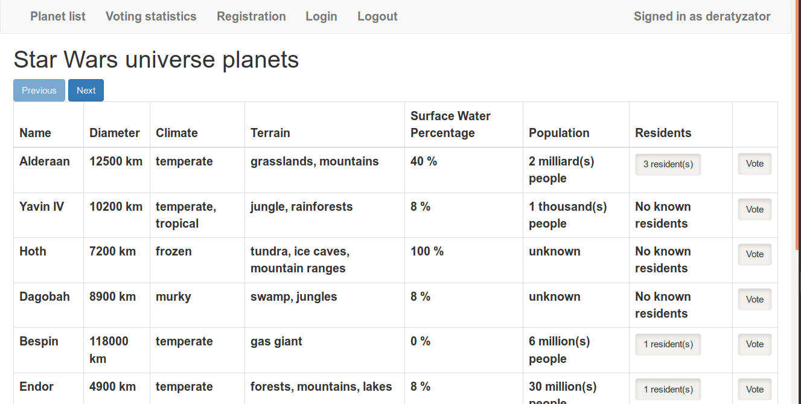

# Api Wars
This is Codecool homework project, a small web application which shows data from 
[Star Wars universe API](https://swapi.co/ "https://swapi.co/")

## How to run
1. Open Terminal, go to the direcotry where project is located
2. Activate your virualenv
2. Install all requirements: `pip install -r requirements.txt`
3. Start server: `python3 app.py`

## Dependencies
- Python 3.6.7
- pip 19.0.1

## Screenshot
